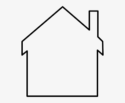

## The Framework for an Easier Life

UI Frameworks are a group of additions that can be added to code. These additions work similarly to libraries in other coding languages. They help simplify difficult things and add functionally that would be hard to achieve without them. The framework that I have been using in ICS 314 is Twitter Bootstrap 5.0 for html and css. I enjoy using the framework because without it, making rows and columns in base html is ridiculously hard. Bootstrap also has additional features for everything that I would need like containers, navigation bar additions, and the grid system. 

Some complaints around UI Frameworks are that they are complicated to learn. They can even be called a separate programming language. I do not think this is the case at all. I think that using a framework is more akin to using a separate library of functions. It is just that these functions improve the already existing base functionality of the language.

The benefits of using a framework greatly outweigh the learning curve. Using frameworks can greatly increase your coding speed and reduce the code you need to type. In addition to this, you need a lot less knowledge of the base language to create more complicated and impressive things.

