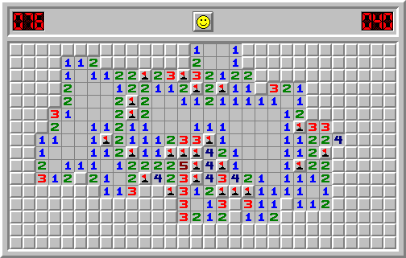

This project was a recreation of the classic game Minesweeper, but implemented in the C language. This had a text based user interface and control scheme. From this project, I learned how to code in C and also how to implement libraries of functions that are not my own.

<pre>
#include "library.h"

int proxy(int mine[r][c], int i, int j)
{
        int sum = 0;

        for(int x = i - 1; x < (i + 2); x++)
        {
                if(x >= 0 && x < r)
                {
                        for(int y = j - 1; y < (j + 2); y++)
                        {
                                if(y >= 0 && y < c)
                                {
                                        if(mine[x][y] == 1)
                                                sum++;
                                }
                        }
                }
        }
        return sum;
}

void update_scores(int mine, int flag, int score)
{
        update_mines(mine);
        update_flags(flag);
        update_score(score);
}

void update_start(int mine[r][c], int flag[r][c], int posr, int posc)
{
        for(int i = 0; i < r; i++)
                for(int j = 0; j < c; j++)
                {
                        if(mine[i][j] == -1)
                                show_glif(SAFE,i,j,proxy(mine,i,j));
                        if(flag[i][j] == 1)
                                show_glif(FLAG,i,j,proxy(mine,i,j));
                }
        show_glif(TIMMY,posr,posc,proxy(mine,posr,posc));
}

void update_display(int mine[r][c], int flag[r][c], int posr, int posc, int value)
{
        switch(value)
        {
                case 1:show_glif(SAFE,posr,posc,proxy(mine,posr,posc));break;
                case 2:show_glif(FLAG,posr,posc,proxy(mine,posr,posc));break;
                case 3:show_glif(TIMMY,posr,posc,proxy(mine,posr,posc));break;
                case 4:show_glif(MINE,posr,posc,proxy(mine,posr,posc));break;
                case 5:show_glif(FL_MINE,posr,posc,proxy(mine,posr,posc));break;
                case 6:show_glif(EXPLODE,posr,posc,proxy(mine,posr,posc));break;
        }
}

void update_player(int mine[r][c], int flag[r][c], int posr, int posc)
{
        show_glif(EMPTY,posr,posc,0);
        update_display(mine,flag,posr,posc,1);
        if(flag[posr][posc] == 1 && mine[posr][posc] == 1)
                update_display(mine,flag,posr,posc,5);
        else if(flag[posr][posc] == 1)
                update_display(mine,flag,posr,posc,2);

}
</pre>

Source: <a href="https://github.com/jogarces/ics-313-text-game"><i class="large github icon "></i>jogarces/ics-313-text-game</a>
