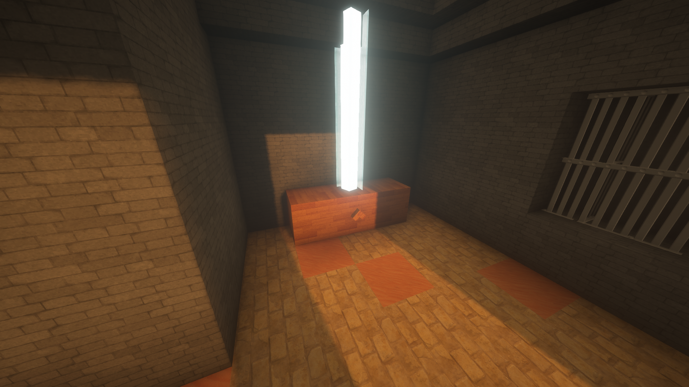
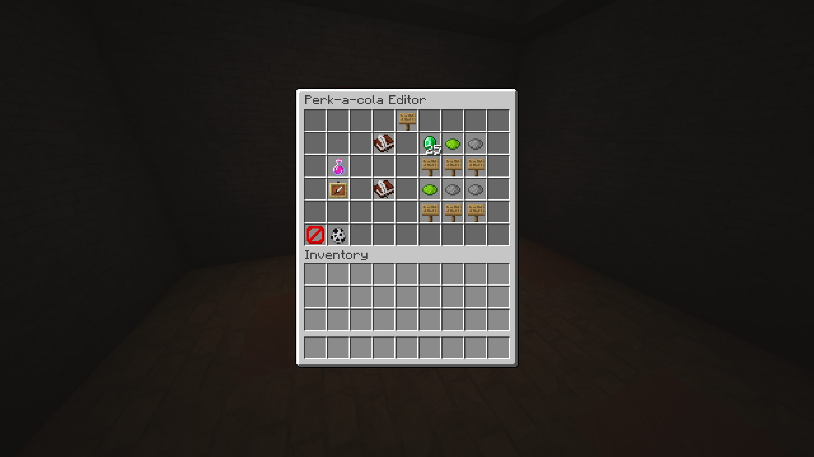

This project aims to allow Minecraft map makers to create all the functionality of Call of Duty Zombies without needing to write a single line of code. What I created was the backend that created functionality for common devices in COD Zombies like Perk-a-cola machines, shops, and mystery boxes. All of these builds are then easily configurable in game.

The main thing I learned when creating this project is to keep the users in mind. This project focuses on making complicated back end stuff more accessible. Therefore, I needed to create an intuitive user interface that would be easy to get into. I also needed to keep in mind that others might not understand my intentions when implementing a build. Something that I might think is obvious might not be the case for others.

Source: <a href="https://github.com/tomidt/zombies"><i class="large github icon "></i>tomidt/zombies</a>
