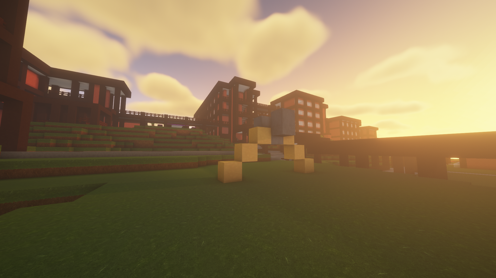
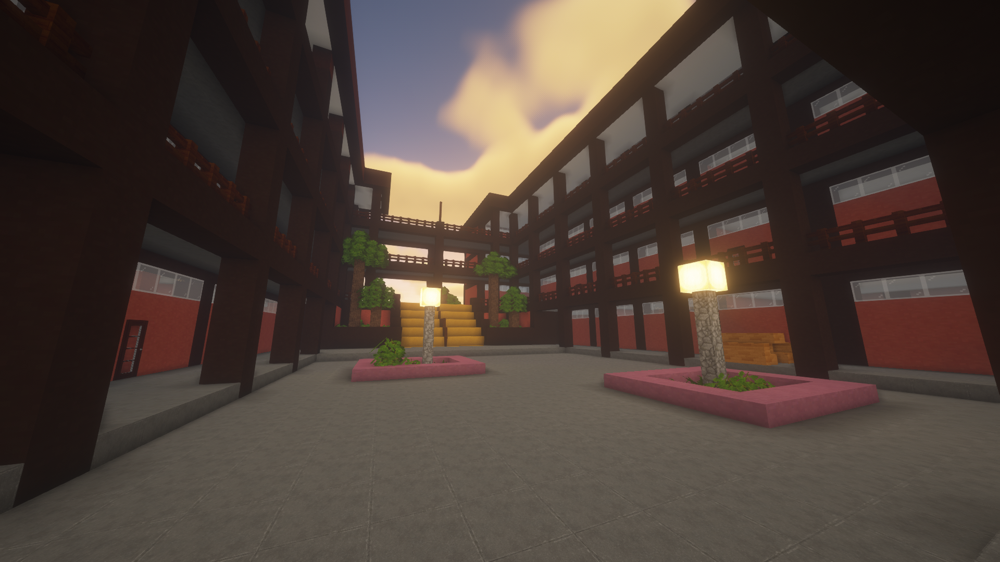

This was a project I started in my senior year of highschool. It was my last year at the school, and I wanted a project that I could look back on far into the future. I decided to recreate the entirety of my highschool in Minecraft. At the time, Minecraft was just starting to come back into mainstream popularity, and it was also a game I spent a large amount of time on. Therefore , combining my hobby with a project was the perfect combination. I worked on it all throughout the year to finish the build by the time I graduated. [A look at the actual school](https://www.pchs.k12.hi.us/).

The most important takeaway from this project was planning and preparation. At the start, I went in blind, relying on my passion and motivation to carry me through. This did not work whatsoever. After I started building off of feel, I quickly encountered the problem that the different buildings would not fit together. Realizing that my plan would not work, I quickly lost the motivation to continue. 

To get over this hump, I restarted with a new plan to make a blueprint beforehand. My first approach was similar to a home constructor trying to build a house by feel, and making large decisions on the fly. With this new approach, I spent multiple months planning out and mapping how large each building would be, the pathways connecting each building, and the terrain surrounding everything. It was tedious work but necessary work nonetheless. But with the final project finished, I was extremely satisfied with the results. 

Source: <a href="https://github.com/tomidt/school/tree/main"><i class="large github icon "></i>tomidt/school</a>
